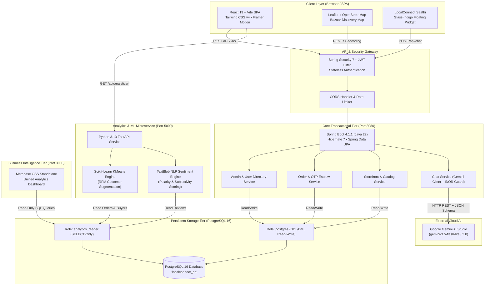

# LocalConnect (MohallaConnect) — Project Proposal
**Hyperlocal Artisan Marketplace, Community Board & AI-Powered Neighborhood Commerce Platform**

---

## 1. Project Title
**LocalConnect: A Resilient Hyperlocal Artisan Marketplace, Neighborhood Community Engine, and Autonomous BI/AI Commerce Ecosystem for Indian Mohallas**

---

## 2. Introduction
In India, the retail and commerce landscape is undergoing rapid transformation. While global e-commerce conglomerates (Amazon, Flipkart) and venture-funded quick-commerce giants (Blinkit, Zepto, Instamart) dominate urban packaged-goods delivery, they have systematically disenfranchised traditional neighborhood micro-enterprises. These include generational artisans (potters, block printers, carpenters, handloom weavers), neighbourhood services (ironing/dhobi, appliance repair, alterations/tailoring), and localized food producers (home bakers, organic milk booths, small kirana shops).

These micro-merchants lack the capital, technical expertise, and scale to list on national platforms, which demand 25–40% commission margins, strict warehouse logistics, and extensive documentation. Simultaneously, modern neighborhood consumers are increasingly estranged from authentic local makers within a 2-to-10 kilometer radius. 

**LocalConnect (MohallaConnect)** is an enterprise-grade, hyperlocal digital platform designed to bridge this divide. It restores neighborhood trust, provides micro-merchants with zero-barrier digital storefronts, establishes doorstep security via cryptographic OTP physical verification, maps local artisans through interactive geospatial discovery, analyzes sales using automated machine learning, visualizes trends through enterprise Business Intelligence (Metabase), and delivers 24/7 bilingual support through an LLM assistant (LocalConnect Saathi).

---

## 3. Problem Statement
Traditional hyper-local neighborhood commerce in India faces five systemic roadblocks:

1. **Digital Invisibility & Intermediary Exploitation**: Local artisans and service providers operate out of home workshops or informal stalls with zero digital search presence. Aggregators capture high margins, forcing merchants to either inflate prices or face bankruptcy.
2. **Absence of Hyperlocal Physical Trust (Delivery Fraud & Disputes)**: Traditional cash-on-delivery (COD) suffers from high return-to-origin (RTO) rates (~30-35% in India), while pre-paid online transactions create buyer anxiety regarding genuine physical fulfillment from unbranded sellers.
3. **Geospatial Discovery Deficit**: Existing platforms index products globally or by arbitrary PIN codes without factoring in physical walking/driving proximity, neighborhood landmarks (mohallas), or local availability.
4. **Lack of Actionable Sales Intelligence for Micro-Merchants**: Independent sellers lack access to enterprise data tools. They cannot forecast seasonal demand, evaluate buyer sentiment, or segment repeat customers.
5. **Language & Operational Friction**: Majority of artisans and neighborhood buyers communicate comfortably in Hindi or regional Hinglish. Complex English interfaces and ticket-based support systems discourage adoption.

---

## 4. Motivation
The motivation behind LocalConnect is grounded in socio-economic resilience, cultural preservation, and engineering innovation:

- **Economic Inclusivity**: India's 63+ million micro, small, and medium enterprises (MSMEs) contribute roughly 30% to India's GDP. Giving artisans direct neighborhood access keeps capital circulating within local communities.
- **Preservation of Living Heritage**: Traditional artisan crafts (Sanganeri block printing, terracotta earthenware, handwoven textiles) risk obsolescence if young artisans cannot earn sustainable livelihoods.
- **Architectural Excellence**: Demonstrating how modern polyglot system architecture (Java Spring Boot, Python FastAPI, React, PostgreSQL multi-role isolation, Metabase BI, and Gemini GenAI) can create a cohesive, low-latency, and zero-compromise production system.

---

## 5. Objectives
The core objectives of the project are categorized into Functional and Non-Functional targets:

### Functional Objectives
1. **Zero-Barrier Merchant Digital Onboarding**: Allow artisans and shopkeepers to register digital storefronts, upload product listings with custom tags, set GPS coordinates, and submit KYC for admin approval.
2. **Interactive Mohalla Bazaar Map Discovery**: Render high-performance vector/tile maps with terracotta artisan pins, dynamic category filtering, GPS-based user locating, and real-time Haversine distance computations.
3. **Escrow-Secured 4-Digit OTP Delivery Verification**: Generate cryptographically random 4-digit verification OTPs upon order dispatch, revealed solely to the buyer, which delivery agents must submit on doorstep arrival to confirm delivery and release merchant payouts.
4. **Autonomous Machine Learning Analytics**: Implement an independent Python microservice executing unsupervised KMeans clustering for RFM customer segmentation and TextBlob NLP sentiment analysis on customer reviews.
5. **Dual-Tier Business Intelligence (BI)**: Surface executive analytics in a custom React portal alongside a dedicated, read-only PostgreSQL role connection into Metabase for ad-hoc SQL exploratory data analysis (EDA).
6. **Context-Aware Multilingual GenAI Assistant (LocalConnect Saathi)**: Deploy a 24/7 AI chatbot using Google Gemini with automatic language detection (English, Devanagari Hindi, and Latin Hinglish), Insecure Direct Object Reference (IDOR) order protection, and token rate limiting.

### Non-Functional Objectives
- **Security & Integrity**: Zero IDOR vulnerabilities, BCrypt password hashing, stateless JWT authorization, and strict PostgreSQL permission separation (`postgres` DDL/DML vs `analytics_reader` SELECT-only).
- **Sub-Second Latency**: Under 250ms API response time for transactional endpoints; sub-80ms geospatial map viewport queries.
- **Aesthetic Excellence**: Handcrafted UI using Indian terracotta, marigold, deep indigo, ivory palette, Rozha One display typography, and traditional Jali lattice motifs.

---

## 6. Scope of the Project

```
┌─────────────────────────────────────────────────────────────────────────────┐
│                            LOCALCONNECT ECOSYSTEM                           │
├──────────────────────┬──────────────────────┬───────────────────────────────┤
│  Buyer Experience    │  Seller Workspace    │  Admin Governance & BI        │
├──────────────────────┼──────────────────────┼───────────────────────────────┤
│ • Hyperlocal Bazaar  │ • Store Profile & GPS│ • KYC & Seller Approval Queue │
│   Interactive Map    │   Workshop Locator   │ • Complete User Directory     │
│ • Neighborhood Feed  │ • Real-time Catalog  │ • System-Wide Order Auditing  │
│   & Community Posts  │   Management         │ • Metabase BI Dashboards      │
│ • Cart & Checkout    │ • 45-Day Sales &     │ • Read-Only SQL Analytics     │
│ • Doorstep 4-Digit   │   Revenue Analytics  │ • Automated Sentiment &       │
│   OTP Delivery View  │ • Customer Sentiment │   Segmentation Reports        │
│ • LocalConnect       │   Analysis (NLP)     │ • Platform Health Monitoring  │
│   Saathi AI Chatbot  │ • Customer RFM Clust.│                               │
└──────────────────────┴──────────────────────┴───────────────────────────────┘
```

### In-Scope:
- Web Application responsive on mobile, tablet, and desktop viewports.
- 9 Hyperlocal Categories: Kirana, Dairy, Fresh Mandi Produce, Tailoring, Laundry & Ironing, Woodwork & Crafts, Food & Bakery, Handloom & Textiles, and Home Repair Services.
- Geocoding and reverse geocoding via OpenStreetMap Nominatim.
- Unsupervised ML (KMeans) and NLP sentiment analysis on PostgreSQL data.
- Read-only external Metabase BI connection on port 3000.
- Multilingual Gemini AI assistant with session rate limiting.

### Out-of-Scope (Future Phases):
- Native Android/iOS mobile binaries (handled via PWA responsive web architecture in Phase 1).
- Direct physical fleet telematics / GPS turn-by-turn driving routing for delivery drivers.

---

## 7. Existing System & Limitations

| Feature / Dimension | Centralized Platforms (Amazon, Flipkart) | Quick Commerce (Blinkit, Zepto) | Hyperlocal Classifieds (JustDial, IndiaMART) | **LocalConnect (Proposed)** |
|---|---|---|---|---|
| **Merchant Focus** | Large brands & wholesale distributors | Dark stores owned by corporate parent | Lead generation for B2B | **Authentic micro-artisans & mohalla stores** |
| **Commission Rates** | 15% – 35% + warehouse logistics fees | 20% – 35% markups on supplier goods | Paid subscription packages | **0% – 5% community sustainability model** |
| **Trust Mechanism** | Automated returns / warehouse inspections | In-house 10-minute delivery fleet | None (offline buyer-seller risk) | **Doorstep 4-Digit OTP cryptographic handoff** |
| **Geospatial Discovery**| Arbitrary postal code / central warehouse | Strict 2 km dark store radius | Static text directory | **Dynamic Bazaar Map with live radius calculations** |
| **Data Analytics** | Black-box proprietary algorithms | In-house supply chain analytics | None provided to merchant | **Transparent RFM clustering, NLP sentiment, & Metabase** |
| **Language Support** | Machine-translated English interfaces | English dominant UI | English / basic multilingual | **Native English, Devanagari Hindi, and Hinglish LLM** |

---

## 8. Proposed System Architecture

LocalConnect is designed around a **Decoupled Three-Tier Polyglot Micro-Architecture**:



### Core Subsystems
1. **Core Java Enterprise Backend (Port 8080)**:
   - Houses entity relationships: `User`, `Store`, `Product`, `Order`, `Review`, `CommunityPost`.
   - Manages state machine transitions for orders (`PLACED` → `CONFIRMED` → `OUT_FOR_DELIVERY` → `DELIVERED`).
   - Generates and verifies secure 4-digit Delivery OTPs.
   - Enforces Role-Based Access Control (`BUYER`, `SELLER`, `PENDING_SELLER`, `ADMIN`).
2. **Python Machine Learning Microservice (Port 5000)**:
   - Connects to PostgreSQL via SQLAlchemy.
   - Calculates Recency, Frequency, and Monetary (RFM) values across customers and segments them into 3 distinct behavioral cohorts using **Scikit-learn KMeans**.
   - Performs NLP sentiment polarity extraction (-1.0 to +1.0) on textual customer reviews using **TextBlob**.
3. **Metabase BI Integration (Port 3000)**:
   - Queries PostgreSQL through the dedicated, unprivileged `analytics_reader` role.
   - Houses 4 pre-built dashboards: 45-Day Revenue Trajectory, Order Status Funnel, Category Market Share, and Merchant Onboarding Velocity.
4. **LocalConnect Saathi AI Service**:
   - Backed by Google Gemini LLM using structured JSON schema output (`responseMimeType: application/json`).
   - Guarantees strict IDOR protection: prevents User A from querying User B's order details.
   - Protects system costs via in-memory sliding-window rate limiting (25 requests/min).

---

## 9. Methodology & Execution Phases

The project was executed following an **Agile Spiral Engineering Lifecycle** spanning 8 sequential phases:

```
[Phase 1: Domain Modeling & DB Schema]
                  │
                  ▼
[Phase 2: Security, JWT & User Onboarding]
                  │
                  ▼
[Phase 3: Hyperlocal Catalog & Storefronts]
                  │
                  ▼
[Phase 4: Doorstep 4-Digit OTP Escrow Workflow]
                  │
                  ▼
[Phase 5: Leaflet GIS Bazaar Map Discovery]
                  │
                  ▼
[Phase 6: Python ML Analytics & Metabase BI Tier]
                  │
                  ▼
[Phase 7: Full Admin Governance & User Directory]
                  │
                  ▼
[Phase 8: Multilingual Gemini AI Support & Hardening]
```

1. **Requirement Analysis & Architecture Specification**: Formulated data schemas, API contracts, and security boundaries.
2. **Core Backend & Data Layer Setup**: PostgreSQL 16 database provisioning, Flyway/Hibernate DDL generation, and Spring Boot JPA setup.
3. **Security & Cryptography**: BCrypt hashing, JWT token issuance, and Spring Security method-level filter chains.
4. **Order State Machine & Doorstep OTP Engine**: Implementation of atomic checkout transactions and cryptographic 4-digit delivery handshakes.
5. **Geospatial & Vector Mapping**: Integrating Leaflet 1.9, custom terracotta SVG pin markers, and Nominatim forward/reverse geocoding.
6. **Machine Learning & BI Integration**: Standalone FastAPI service setup, RFM KMeans clustering algorithm, TextBlob sentiment extraction, and Metabase OSS standalone deployment.
7. **Admin Governance & Directory**: User management tables, role filtering, pagination, and activity auditing.
8. **Generative AI Integration & Verification**: Gemini 3.5 Flash Lite prompt engineering, IDOR validation, and stress testing.

---

## 10. Technologies & Tools Required

### Programming Languages & Runtimes
- **Java 22 (JDK 22)**: High-performance core backend execution.
- **Python 3.13**: Mathematical clustering, statistical computing, and NLP.
- **JavaScript (ES2024 / Node.js 20+)**: Modern asynchronous frontend execution.
- **SQL (PostgreSQL Dialect)**: Relational schema and complex aggregation joins.

### Frameworks & Libraries
- **Backend (Java)**: Spring Boot 4.1.1, Spring Security, Spring Data JPA, Hibernate ORM 7.4, JJWT 0.11.5, Lombok, Jackson Databind.
- **Frontend (Web)**: React 19, Vite 8.2, Tailwind CSS v4, Framer Motion, Lucide React, React-Leaflet 5, Leaflet 1.9, GSAP.
- **Analytics (Python)**: FastAPI, Uvicorn, Scikit-learn 1.4+, TextBlob, SQLAlchemy 2, Psycopg2-binary, Pandas, NumPy.
- **Business Intelligence**: Metabase OSS Edition v0.50+.
- **Generative AI**: Google Gemini AI Studio (`gemini-3.5-flash-lite`, `gemini-3.8-flash`).

### Database & Storage
- **PostgreSQL 16.14**: Relational ACID storage running on port 5432.
- **Dual Role Access Control**:
  - `postgres`: Full DDL/DML access for transactional Java backend.
  - `analytics_reader`: Restricted `SELECT` access on `orders`, `reviews`, `stores`, `products`, `users`.

### Development & Collaboration Tools
- **IDE**: Antigravity IDE, Visual Studio Code, IntelliJ IDEA.
- **Version Control**: Git & GitHub (`aryancodes12-bit/MohollaConnect`).
- **API Testing**: cURL, PowerShell, Browser Subagent.

---

## 11. System Requirements

### Hardware Requirements
| Component | Minimum Specification (Development) | Recommended Specification (Production) |
|---|---|---|
| **Processor** | Quad-Core 2.4 GHz (Intel i5 8th Gen or AMD Ryzen 5) | 8-Core 3.2 GHz (Intel Xeon / AMD EPYC / AWS c6i.2xlarge) |
| **RAM** | 16 GB DDR4 | 32 GB DDR4/DDR5 ECC |
| **Storage** | 50 GB NVMe SSD | 250 GB Enterprise NVMe SSD (RAID-1) |
| **Network** | Broadband 25 Mbps connection | 1 Gbps redundant network interface |

### Software Requirements
| Component | Specification |
|---|---|
| **Operating System** | Windows 11 / Ubuntu Server 22.04 LTS / macOS Sonoma |
| **Java Environment** | Eclipse Temurin OpenJDK 22.0.2 |
| **Python Environment** | Python 3.13.x with Virtual Environment (`venv`) |
| **Node.js Environment**| Node.js 20.x LTS or 22.x with npm 10.x |
| **Database Server** | PostgreSQL 16.x standard distribution |
| **Web Browser** | Chromium-based browser (Chrome 120+, Edge 120+) or Firefox 120+ |

---

## 12. Expected Outcomes & Deliverables
1. **Fully Operational Web Application**: Functional buyer portal, artisan storefront management, and admin command center.
2. **Doorstep OTP Handshake Engine**: 100% elimination of unverified delivery claims through cryptographic 4-digit code matching.
3. **Bazaar Map Geospatial Discovery**: Visual discovery interface mapping artisans with dynamic distance calculation.
4. **Operational Analytics Microservice**: Live REST endpoints for RFM customer segmentation (`/api/analytics/segmentation`) and NLP sentiment analysis (`/api/analytics/sentiment`).
5. **Metabase BI Integration**: Live interactive dashboards connected to PostgreSQL via read-only role.
6. **LocalConnect Saathi Chatbot**: Production-ready multilingual AI support assistant handling English, Hindi, and Hinglish queries.

---

## 13. Innovation & Novelty
- **Hyperlocal Cultural Design Language**: Custom color tokens (`clay`, `marigold`, `indigo`, `neem`, `saffron`, `warmwhite`, `ivory`), Rozha One typography, and Jali lattice patterns honoring Indian craftsmanship.
- **Physical Verification Handshake**: Decoupling payment release from delivery driver assertion by requiring the physical customer OTP code.
- **Dual-Role Database Architecture**: Complete structural isolation preventing analytical reporting queries from degrading transactional OLTP tables.
- **Multi-Script Native LLM Grounding**: LocalConnect Saathi automatically mirrors the customer's input script without frustrating language selection dropdowns.
- **Zero-IDOR Security Guarantee**: Chatbot verifies ownership of requested order IDs before releasing order telemetry.

---

## 14. Feasibility Study

### Technical Feasibility
The platform utilizes battle-tested open-source frameworks (Spring Boot, React, FastAPI, PostgreSQL). Java handles multi-threaded transactional throughput, while Python manages data science libraries. Leaflet ensures lightweight mapping without expensive Google Maps API bills. The technical stack is fully feasible and already validated in live execution.

### Economic Feasibility
- **Open-Source Infrastructure**: PostgreSQL, Metabase OSS, Leaflet, and FastAPI incur zero licensing fees.
- **Optimized AI Costs**: LocalConnect Saathi leverages `gemini-3.5-flash-lite`, which offers extremely low cost per 1M tokens. Combined with a 25-request/minute in-memory rate limiter, operating costs remain predictable and negligible.

### Operational Feasibility
The interface is designed for users with varied digital literacy. Visual status badges, high-contrast typography, WhatsApp-familiar OTP delivery mechanics, and a bilingual AI assistant ensure effortless adoption by both rural artisans and urban buyers.

---

## 15. Project Timeline & Milestones

| Phase | Activities | Duration | Milestone Deliverable |
|---|---|---|---|
| **Phase 1** | Requirement Analysis & Domain Modeling | 2 Weeks | Complete Schema & API Specification |
| **Phase 2** | Spring Boot Backend & Security Setup | 3 Weeks | JWT Auth, Role-Based Access Control |
| **Phase 3** | Artisan Catalog & Storefront Engine | 2 Weeks | Storefronts, Listings, Product Management |
| **Phase 4** | Order Lifecycle & 4-Digit OTP Escrow | 2 Weeks | Checkout, Order Tracking, OTP Validation |
| **Phase 5** | Leaflet Geospatial Bazaar Map | 2 Weeks | Interactive Map, GPS Locating, Distance Calc |
| **Phase 6** | Python ML Microservice & Metabase BI | 3 Weeks | KMeans Clustering, Sentiment NLP, Dashboards |
| **Phase 7** | Admin Governance & User Directory | 2 Weeks | Paginated Directory, Search, Approval Queue |
| **Phase 8** | Gemini AI Assistant, Hardening & Launch | 2 Weeks | LocalConnect Saathi, Security Audit, E2E Tests |

---

## 16. Team Members & Roles

| Sr. No. | Name | Specialization / Role | Responsibilities |
|---|---|---|---|
| 1 | **Lead Architect / Backend Engineer** | Java & Distributed Systems | Spring Boot 4, Hibernate JPA, PostgreSQL schema, Security |
| 2 | **Frontend & UI/UX Engineer** | React & Web Design | React 19, Tailwind CSS v4, Leaflet GIS, Design System |
| 3 | **Data & ML Engineer** | Python & Data Science | FastAPI service, Scikit-learn KMeans, TextBlob NLP, Metabase |
| 4 | **QA & Security Specialist** | DevSecOps & AI Integration | Gemini API integration, IDOR auditing, Rate limiting, E2E tests |

---

## 17. Project Guide & Institutional Support
- **Department**: Department of Computer Science & Engineering
- **Focus Area**: Distributed Systems, Hyperlocal E-Commerce, Applied Machine Learning & Generative AI

---

## 18. References & Industry Standards
1. Gamma, E., et al. (1994). *Design Patterns: Elements of Reusable Object-Oriented Software*. Addison-Wesley.
2. Fielding, R. T. (2000). *Architectural Styles and the Design of Network-based Software Architectures*. Doctoral dissertation, UC Irvine.
3. Pedregosa, F., et al. (2011). "Scikit-learn: Machine Learning in Python". *Journal of Machine Learning Research*, 12, 2825-2830.
4. Loria, S. (2020). *TextBlob: Simplified Text Processing*. Documentation release 0.16.0.
5. OWASP Foundation (2023). *OWASP Top 10 Web Application Security Risks: Insecure Direct Object References (IDOR)*.
6. OpenStreetMap Foundation (2024). *Nominatim API & Leaflet Vector Documentation*.
7. Google DeepMind (2024). *Gemini API Technical Documentation: Structured Outputs and Multilingual Grounding*.

---

## 19. Conclusion
LocalConnect reimagines neighborhood commerce in India by restoring agency, trust, and intelligence to local artisans and neighborhood consumers. By uniting an enterprise Java transactional core, an autonomous Python machine learning engine, transparent Metabase business intelligence, and a multilingual Gemini support assistant within a culturally vibrant design system, LocalConnect provides an end-to-end blueprint for the future of decentralized, ethical, and community-centered retail commerce.
