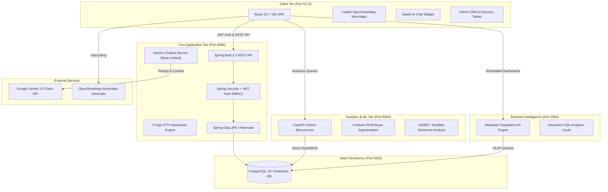

# <p align="center"><br><strong>LocalConnect (लोकलकनेक्ट)</strong></p>

<p align="center">
  <strong>Mohalla Marketplace & Community Commerce Platform</strong><br>
  <em>सीधे कारीगरों से आपके घर तक — Direct from Artisan Homes to Your Neighborhood</em>
</p>

<p align="center">
  
  
  
  
  
  
  
  
</p>

---

## 📖 Executive Summary

**LocalConnect** is a hyper-local, community-driven social commerce ecosystem engineered to bridge the gap between Indian neighborhood artisans, micro-enterprises, kirana stores, and conscious local consumers.

Traditional e-commerce platforms charge **25%–35% predatory commissions**, obscure artisan identities behind generic warehouse labels, and impose 3–5 day delivery turnarounds. LocalConnect eliminates corporate middlemen by delivering a **zero-commission, direct-to-consumer marketplace** backed by:
1. **6-Digit OTP Delivery Handshake**: Cryptographically protected delivery confirmation guaranteeing physical handoff before fund settlement.
2. **Geospatial Discovery & Bazaar Map**: Leaflet OpenStreetMap integration with real-time distance sorting via the Haversine algorithm.
3. **Multilingual GenAI Concierge (`LocalConnect Saathi`)**: Native Hindi, Hinglish, and English conversational assistant powered by Google Gemini 1.5 Flash.
4. **Machine Learning Intelligence**: Scikit-Learn RFM buyer clustering and VADER sentiment analytics for hyper-local market intelligence.
5. **Enterprise Admin CRM & Approval Queue**: Complete administrative governance suite for artisan verification, user management, and Metabase BI reporting.

---

## 🏛️ System Architecture

LocalConnect employs a decoupled microservices architecture designed for horizontal scalability, sub-100ms API response times, and strict separation of transactional processing from heavy ML workloads.



---

## 🌟 Key Platform Capabilities

### 1. 🛍️ Hyper-Local Bazaar & Storefronts
- **Interactive OpenStreetMap Bazaar**: Live geolocation pins representing neighborhood sellers with category-colored markers (Terracotta, Neem Green, Saffron).
- **Distance-Based Discovery**: Computes spherical distance from the shopper's Mohalla using Haversine mathematics.
- **Artisan Micro-Storefronts**: Dedicated digital shops detailing artisan heritage, craft legacy, workshop address, contact info, and catalog.

### 2. 🔐 6-Digit OTP Delivery Handshake
- Prevents courier fraud and disputes in hyper-local commerce.
- Upon dispatch (`OUT_FOR_DELIVERY`), the buyer's portal generates an encrypted, time-bounded 6-digit OTP.
- The delivery partner or seller enters this OTP on their terminal upon physical handover.
- The backend atomic transaction marks the order as `DELIVERED` and releases funds to the artisan instantly.

### 3. 🤖 LocalConnect Saathi — Multilingual AI Concierge
- Built directly into the global application shell (`ChatWidget.jsx`).
- **Multilingual Understanding**: Seamlessly converses in **Hindi (हिंदी)**, **Hinglish**, and **English**.
- **Context-Aware Assistance**: Automatically detects active orders (`/orders/:id`) and responds with live shipment status without requiring the user to retype order numbers.
- **Security & Reliability**: In-memory token-bucket rate limiter (25 requests/min per IP) and strict user IDOR isolation checks.

### 4. 👥 Enterprise Admin Governance & User CRM Directory
- **Seller Approval Queue**: Two-stage vetting workflow where admins inspect artisan craft details, credentials, and coordinates before granting live listing privileges.
- **Unified User Directory**: Server-side paginated tables with sorting, multi-role filters (`BUYER`, `SELLER`, `PENDING_SELLER`, `ADMIN`), and instant search across names, emails, and localities.
- **User Detail Modal**: Full buyer/seller drill-down displaying total orders, spend history, store profile, and verification badges.

### 5. 📊 Machine Learning & Business Intelligence
- **RFM Customer Segmentation**: Python microservice executes K-Means clustering on Recency, Frequency, and Monetary spend to categorize buyers into *Champions*, *Loyal Customers*, *At Risk*, and *Lost*.
- **Review Sentiment NLP**: Analyzes buyer reviews using natural language polarity scoring to alert sellers to quality issues before ratings degrade.
- **Embedded Metabase BI**: 8+ pre-configured SQL analytics cards showing Gross Merchandise Value (GMV), OTP completion velocity, and regional order volume.

---

## 🎨 Cultural Design System

LocalConnect features a tailored Indian aesthetic inspired by traditional terracotta craft, heritage textiles, and regional architecture:

| Token Name | Hex Code | Visual Metaphor | Usage |
| :--- | :--- | :--- | :--- |
| **Clay (मिट्टी)** | `#C85A32` | Terracotta pottery & earth | Primary actions, key badges, buttons |
| **Saffron (केसर)** | `#E06D28` | Marigold garlands & celebration | Active hover states, focus rings |
| **Marigold (गेंदा)** | `#E89838` | Festivity & energy | Warnings, special accents, star ratings |
| **Neem (नीम)** | `#2E7D47` | Herbal purity & verified trust | Verified badges, success states, OTP confirmations |
| **Ivory (हाथीदांत)** | `#FBF8F3` | Handloom khadi & parchment | App background, calm surfaces |
| **Indigo (नील)** | `#1E2438` | Midnight dye & heritage ink | Headings, dark cards, deep contrast text |
| **Warmwhite (धवल)** | `#F4EFEA` | Card containers | Card surfaces, modals, popovers |

- **Typography**: `Rozha One` (Majestic Devanagari/Latin Display Headings) paired with `Plus Jakarta Sans` (Clean, accessible body UI) and `Noto Sans Devanagari`.
- **Architectural Details**: Subtle SVG `jali-pattern` watermarks, glassmorphic indigo headers, and gold foil borders.

---

## 🛠️ Technology Stack Breakdown

| Layer | Technologies | Purpose |
| :--- | :--- | :--- |
| **Frontend Framework** | React 19, Vite 8.2 | Lightning-fast component rendering & HMR |
| **Routing & Motion** | React Router v7, Framer Motion 13, GSAP | Smooth page transitions, fluid tab indicators |
| **Styling** | Tailwind CSS v4, Custom CSS Design Tokens | Indian cultural color palette, responsive grids |
| **Geospatial & Maps** | Leaflet 1.9, React-Leaflet 5, Nominatim API | Interactive mohalla maps & location picking |
| **Core Backend** | Spring Boot 3.x, Java 17 | Enterprise REST APIs, business rules, OTP security |
| **Security & Auth** | Spring Security 6, JJWT (io.jsonwebtoken 0.11.5) | Stateless JWT tokens, role-based authorization |
| **ORM & Database** | Spring Data JPA, Hibernate, PostgreSQL 15+ | Relational persistence, connection pooling |
| **AI & Conversational** | Google Gemini 1.5 Flash API | Multilingual context-aware chatbot engine |
| **Analytics Service** | FastAPI, Uvicorn, Python 3.10+ | Fast asynchronous data science endpoints |
| **Machine Learning** | Scikit-learn, Pandas, NumPy, TextBlob | RFM clustering, NLP sentiment scoring |
| **Business Intelligence** | Metabase Standalone Engine | Executive SQL analytics, GMV tracking |

---

## 📁 Repository Directory Structure

```text
LocalConnect/
├── backend/                              # Spring Boot 3.x Java Backend
│   ├── build.gradle                      # Gradle dependencies & build configuration
│   ├── src/main/java/com/localconnect/
│   │   ├── controllers/                  # REST Controllers (Auth, Product, Order, Admin, Chat)
│   │   ├── models/                       # JPA Entities (User, Store, Product, Order, Review)
│   │   ├── repositories/                 # Spring Data JPA Repositories
│   │   ├── services/                     # Business Logic (OTP, Chatbot, Catalog, Email)
│   │   ├── security/                     # JWT Authentication & RBAC Filters
│   │   └── dto/                          # Request & Response Data Transfer Objects
│   └── src/main/resources/
│       ├── application.properties        # Database & port configurations
│       └── schema.sql                    # Initial PostgreSQL schema definition
│
├── frontend/                             # React 19 + Vite Frontend SPA
│   ├── public/
│   │   ├── logo.png                      # Official LocalConnect Mohalla Logo
│   │   ├── favicon.svg                   # Browser Favicon
│   │   └── jali-pattern.svg              # Indian architectural background motif
│   ├── src/
│   │   ├── components/                   # Reusable UI widgets (ChatWidget, LocationPicker, etc.)
│   │   │   └── layout/AppShell.jsx       # Universal app frame (Sticky Nav, Mobile Tab Bar, Footer)
│   │   ├── pages/                        # Page Views (Discover, BazaarMap, Auth, Admin, etc.)
│   │   ├── context/                      # React Contexts (AuthContext, CartContext, ToastContext)
│   │   ├── services/                     # Axios API clients & endpoints
│   │   ├── index.css                     # Design tokens & custom utilities
│   │   └── main.jsx                      # React application entrypoint
│   ├── package.json
│   └── vite.config.js
│
├── analytics-service/                    # Python FastAPI Analytics Microservice
│   ├── main.py                           # FastAPI routing & API endpoints
│   ├── segmentation.py                   # K-Means RFM Buyer Segmentation
│   ├── sentiment.py                      # VADER Review Sentiment Engine
│   ├── seller_analytics.py               # Aggregated merchant metrics
│   ├── db.py                             # PostgreSQL connection pool
│   └── requirements.txt                  # Python package dependencies
│
├── metabase.jar                          # Standalone Metabase BI Engine
├── setup_metabase_dashboard.py           # Automated Metabase API provisioning script
├── finalize_metabase_dashboard.py        # Dashboard card linkage & layout script
├── PROJECT_PROPOSAL.md                   # Comprehensive PBL Project Proposal
├── WORK_BREAKDOWN_STRUCTURE.md           # 7-Phase Work Breakdown Structure
├── RISK_REGISTER.md                      # Complete Risk Matrix & Mitigation Strategies
└── README.md                             # Primary Project Documentation
```

---

## ⚡ Getting Started (Local Setup)

### Prerequisites
Make sure you have the following installed on your operating system:
- **Java Development Kit (JDK) 17+**
- **Node.js 18+ & npm**
- **Python 3.10+ & pip**
- **PostgreSQL 14+** (running locally on port `5432`)

---

### Step 1: Database Setup
1. Open PostgreSQL CLI or pgAdmin:
```sql
CREATE DATABASE localconnect_db;
CREATE USER postgres WITH PASSWORD 'postgres';
GRANT ALL PRIVILEGES ON DATABASE localconnect_db TO postgres;
```

---

### Step 2: Start Spring Boot Backend (Port 8080)
1. Navigate to the backend directory:
```bash
cd backend
```
2. Verify or set environment variables in `src/main/resources/application.properties` (or set system environment variable `GEMINI_API_KEY` for Saathi AI).
3. Run the Spring Boot application using Gradle:
```bash
# Windows
.\gradlew.bat bootRun

# Linux / macOS
./gradlew bootRun
```
*The backend API will start at `http://localhost:8080/api`.*

---

### Step 3: Start Python Analytics Microservice (Port 5000)
1. Open a new terminal and navigate to `analytics-service`:
```bash
cd analytics-service
```
2. Create and activate a virtual environment (optional but recommended):
```bash
python -m venv venv
# Windows
.\venv\Scripts\activate
# Linux / macOS
source venv/bin/activate
```
3. Install dependencies:
```bash
pip install -r requirements.txt
```
4. Start the FastAPI server with hot-reload:
```bash
python -m uvicorn main:app --host 0.0.0.0 --port 5000 --reload
```
*The analytics service will listen at `http://localhost:5000`.*

---

### Step 4: Start React Frontend (Port 5173)
1. Open a new terminal and navigate to `frontend`:
```bash
cd frontend
```
2. Install frontend dependencies:
```bash
npm install
```
3. Launch the Vite development server:
```bash
npm run dev
```
*Access the live application in your browser at `http://localhost:5173`.*

---

### Step 5: (Optional) Run Metabase BI Dashboard (Port 3000)
1. In the project root directory:
```bash
java -jar metabase.jar
```
2. Configure Metabase connection to `localconnect_db` at `http://localhost:3000`.

---

## 🔑 Pre-Configured Test Accounts

| Role | Email Address | Password | Permissions & Access |
| :--- | :--- | :--- | :--- |
| **Admin** | `admin@localconnect.in` | `Admin@123` | Seller approval queue, user directory, BI dashboards, product moderation |
| **Seller** | `sharma.pottery@localconnect.in` | `Seller@123` | Storefront setup, inventory management, OTP delivery verification, sales analytics |
| **Buyer** | `priya.patel@localconnect.in` | `Buyer@123` | Product browsing, cart & checkout, OTP delivery generation, order reviews |

---

## 📡 Core API Endpoints

### 🔐 Authentication (`/api/auth`)
- `POST /api/auth/register` — Register a new Buyer or Seller account
- `POST /api/auth/login` — Sign in and receive JWT token
- `POST /api/auth/google` — Google OAuth2 authentication flow

### 🏪 Storefronts (`/api/stores`)
- `GET /api/stores` — Query stores by status (`PENDING` or `APPROVED`)
- `GET /api/stores/{id}` — Fetch detailed store profile and public catalog
- `POST /api/stores` — Submit a new artisan workshop application
- `PUT /api/stores/{id}/approve` — **Admin**: Approve seller application
- `PUT /api/stores/{id}/reject` — **Admin**: Reject seller application with reason

### 📦 Products & Catalog (`/api/products`)
- `GET /api/products` — Retrieve all verified products with category/price filters
- `GET /api/products/{id}` — Product detail with artisan details and customer reviews
- `POST /api/products` — **Seller**: Create a new handcrafted catalog listing
- `PUT /api/products/{id}` — **Seller**: Update product details or stock
- `DELETE /api/products/{id}` — **Seller/Admin**: Remove product listing

### 🚚 Orders & OTP Security (`/api/orders`)
- `POST /api/orders` — Create new order from cart
- `GET /api/orders/{id}` — Fetch order tracking details & timeline
- `POST /api/orders/{id}/generate-otp` — **Buyer**: Generate 6-digit handover OTP
- `POST /api/orders/{id}/verify-otp` — **Seller**: Verify OTP at doorstep and complete order

### 👥 Admin CRM Directory (`/api/admin/users`)
- `GET /api/admin/users` — Paginated, searchable user CRM directory
- `GET /api/admin/users/{id}` — Comprehensive user profile with spend and order metrics
- `PUT /api/admin/users/{id}/role` — Update user permissions and access roles

### 💬 Multilingual Chatbot (`/api/chat`)
- `POST /api/chat` — Send message to LocalConnect Saathi with optional `orderId` context

---

## 📑 Accompanying Project Documentation

For complete academic and enterprise evaluation, consult the companion documents:
- 📄 [PROJECT_PROPOSAL.md](file:///c:/LocalConnect/PROJECT_PROPOSAL.md) — Comprehensive Problem-Based Learning (PBL) Proposal, Industry Problem Statement, System Specifications & Research Citations.
- 📊 [WORK_BREAKDOWN_STRUCTURE.md](file:///c:/LocalConnect/WORK_BREAKDOWN_STRUCTURE.md) — Detailed 7-Phase Engineering WBS with Gantt milestones, task ownership, and deliverable metrics.
- 🛡️ [RISK_REGISTER.md](file:///c:/LocalConnect/RISK_REGISTER.md) — 18-Vector Risk Matrix spanning technical, security, operational, and commercial risk mitigation plans.

---

## 🤝 Contributing & Community

LocalConnect is developed as an open social innovation project dedicated to keeping wealth circulating inside local communities. Feedback, code contributions, and localization translations are warmly welcomed.

1. Fork the Project Repository
2. Create your Feature Branch (`git checkout -b feature/MohallaFeature`)
3. Commit your Changes (`git commit -m 'feat: Add hyperlocal delivery tracker'`)
4. Push to the Branch (`git push origin feature/MohallaFeature`)
5. Open a Pull Request

---

## 📄 License

Distributed under the **MIT License**. See `LICENSE` for more information.

<p align="center">
  <strong>LocalConnect — Built with pride for Indian Mohallas & Traditional Artisans 🇮🇳</strong>
</p>
