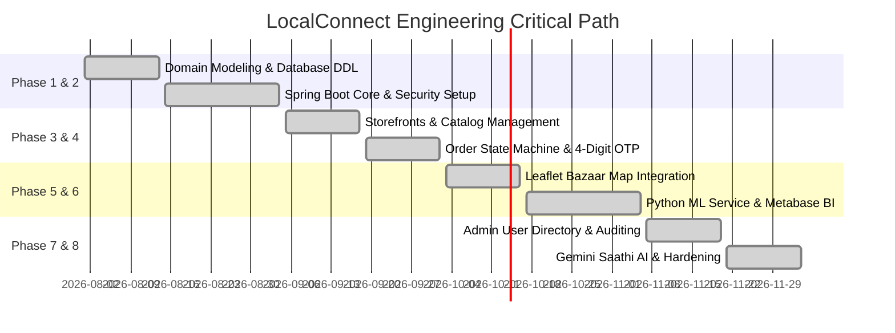

# LocalConnect (MohallaConnect) — Work Breakdown Structure (WBS)
**Hierarchical Project Decomposition, Work Packages & Engineering Specifications**

---

## 1. Executive Summary & Purpose
A **Work Breakdown Structure (WBS)** is a deliverables-oriented hierarchical decomposition of a project into manageable components. In the engineering and delivery of **LocalConnect (MohallaConnect)**, the WBS serves as the foundational framework to define technical scope, establish clear ownership across the engineering team, schedule sprints, manage inter-dependencies, and verify functional milestones.

---

## 2. High-Level Work Package Overview

| Level | Work Package | Primary Subtasks | Lead Role | Deliverables |
|---|---|---|---|---|
| **1.0** | **Project Management & Governance** | Planning, Sprint Scheduling, Resource Allocation, Milestones, Stakeholder Reviews | Project Manager | Project Charter, Sprint Backlogs, Velocity Reports |
| **2.0** | **Requirements Gathering & Domain Analysis** | Stakeholder Discovery, User Personas, Hyperlocal Commerce Workflow, Requirement Spec | Product Owner | Software Requirements Specification (SRS), User Stories |
| **3.0** | **System Architecture & UI/UX Design** | Polyglot Micro-Architecture, DB Entity Design, Indian Cultural Design System, Wireframes | Lead Architect & UI Designer | Architecture Blueprint, Figma Wireframes, CSS Design System |
| **4.0** | **Core Engineering & Full-Stack Development** | Frontend SPA, Spring Boot Backend, PostgreSQL Schema, Python Analytics, Metabase BI, Gemini AI | Engineering Team | Production Source Code, REST APIs, Microservices, BI Reports |
| **5.0** | **Testing, Security & Quality Assurance** | Unit Testing, Integration Testing, IDOR Security Audits, E2E Browser Testing, User Acceptance | QA & Security Lead | Test Automation Suites, Security Audit Report, QA Sign-off |
| **6.0** | **DevOps, Build & Deployment** | CI/CD Pipelines, Multi-Service Orchestration, Database Migrations, Production Launch | DevOps Engineer | Docker Compose / Deployment Scripts, Runbooks, Live URL |
| **7.0** | **Maintenance & Operational Support** | Telemetry, Bug Triage, Performance Tuning, Security Patching, Model Monitoring | SRE & Operations | SLA Dashboard, Bug Fix Patches, Knowledge Base |

---

## 3. Detailed WBS Table (Level 1.0 to Level 4.0)

| WBS Code | Work Package / Subtask | Description & Technical Scope | Key Deliverables |
|---|---|---|---|
| **1.0** | **Project Management** | Overarching project planning, coordination, and control | Approved Project Plan |
| 1.1 | Project Inception & Charter | Define project goals, objectives, constraints, and success criteria | Project Charter Document |
| 1.2 | Agile Sprint Planning | Establish 2-week sprint cadences, backlog grooming, and task allocation | JIRA / GitHub Project Boards |
| 1.3 | Budget & Resource Monitoring | Track compute costs (Cloud, Gemini API tokens, database storage) | Financial & Resource Ledger |
| 1.4 | Milestone Review & Gate Checks | Conduct phase-end reviews and go/no-go quality evaluations | Milestone Sign-Off Artifacts |
| **2.0** | **Requirements Gathering & Domain Modeling** | Deep-dive research into Indian mohalla retail and artisan commerce | Comprehensive SRS |
| 2.1 | Stakeholder Interviews | Interviews with local shopkeepers, potters, weavers, and neighborhood buyers | User Persona Documents |
| 2.2 | Business Logic Specification | Define order lifecycle, OTP physical handoff mechanics, and KYC verification | Functional Requirements Document |
| 2.3 | Non-Functional Requirements | Define throughput targets (<250ms API), uptime (99.9%), and IDOR policies | NFR Matrix |
| 2.4 | Compliance & Security Strategy | Outline data privacy guidelines, password encryption, and multi-role DB rules | Security & Compliance Guide |
| **3.0** | **System Architecture & UI/UX Design** | Structural design of frontend, backend, analytics, and cultural design tokens | Technical Architecture Document |
| 3.1 | Micro-Architecture Blueprint | Polyglot multi-service design: Spring Boot (8080), FastAPI (5000), Metabase (3000) | System Architecture Diagram |
| 3.2 | Database Entity-Relationship Modeling | Relational schema modeling for Users, Stores, Products, Orders, Reviews, Posts | ER Diagram & SQL DDL |
| 3.3 | Cultural Design System Specification | Curate palette (`clay`, `marigold`, `indigo`, `neem`), typography (`Rozha One`), Jali motif | `index.css` Design Tokens & Styleguide |
| 3.4 | UI Wireframes & Mockups | Mobile-first wireframes for Discover, Bazaar Map, Storefront, Cart, Admin, Chat | Figma / High-Fidelity Mockups |
| **4.0** | **Core Engineering & Full-Stack Development** | Implementation of all software components across the stack | Operational Application Codebase |
| **4.1** | **Frontend Client (React 19 + Vite)** | Responsive single-page application built with modern component architecture | Tested Web Application Bundle |
| 4.1.1 | Core App Shell & Routing | Navigation, responsive header, mobile tab bar, protected route wrappers | `App.jsx`, `AppShell.jsx` |
| 4.1.2 | Authentication & User Context | Registration, Login, JWT storage, Role state context, Toast provider | `AuthContext.jsx`, `AuthPage.jsx` |
| 4.1.3 | Discover Page & Category Filter | Hyperlocal category pill navigation, curated artisan spotlights, search bar | `DiscoverPage.jsx` |
| 4.1.4 | Bazaar Interactive Leaflet Map | OpenStreetMap tile layers, custom terracotta SVG pins, live Haversine distance | `BazaarMapPage.jsx`, `mapIcons.js` |
| 4.1.5 | Artisan Storefronts & Listings | Merchant hero banner, category badge, store location mini-map, product catalog | `StorefrontPage.jsx` |
| 4.1.6 | Cart, Checkout & Address Picker | Shopping cart context, item quantity controls, multi-item checkout grouped | `CartContext.jsx`, `CheckoutPage.jsx` |
| 4.1.7 | Order Tracking & OTP Display | Live order progress steps, OTP reveal on dispatch, delivery address details | `OrderTrackingPage.jsx` |
| 4.1.8 | Seller Portal & Inventory Workspace| Product creator/editor modal, stock adjustment, store profile settings | `SellerDashboard.jsx`, `StoreSettingsPage.jsx`|
| 4.1.9 | Admin Governance & User Directory | Tabbed Buyer/Seller table, server-side sorting, pagination, user activity modal | `AdminUserDirectoryPage.jsx` |
| 4.1.10| LocalConnect Saathi Chat Widget | Floating calmer glass-indigo bubble, multilingual chat, suggested link buttons | `ChatWidget.jsx` |
| **4.2** | **Backend Services (Spring Boot 4.1.1)**| Enterprise Java transactional API server running on port 8080 | Java REST API Server JAR |
| 4.2.1 | Security & Stateless JWT Filter | BCrypt password encoder, JJWT issuance, authorization filter chain | `SecurityConfig.java`, `JwtTokenProvider.java`|
| 4.2.2 | User & Authentication Module | User registration, login verification, profile management, role assignment | `AuthController.java`, `UserService.java` |
| 4.2.3 | Store & Merchant Lifecycle | Store creation, status workflow (`PENDING` → `APPROVED`), category assignment | `StoreController.java`, `StoreService.java` |
| 4.2.4 | Product Catalog Management | CRUD operations for product listings, stock quantity updates, price formatting | `ProductController.java`, `ProductService.java`|
| 4.2.5 | Order State Machine & OTP Engine | Atomic checkout, checkoutGroupId, 4-digit random OTP generation and validation | `OrderController.java`, `OrderService.java` |
| 4.2.6 | Admin Directory & Auditing API | Paginated multi-table user queries, total spent joins, merchant verification | `AdminController.java`, `AdminService.java` |
| 4.2.7 | Saathi AI Chat Backend Controller | Gemini HTTP client, system instruction builder, IDOR check, rate limiting | `ChatController.java`, `ChatService.java` |
| **4.3** | **Database Tier (PostgreSQL 16)** | Relational storage engine with ACID guarantees and multi-role security | Migrated PostgreSQL Database |
| 4.3.1 | Schema Definition & Indices | Tables for users, stores, products, orders, reviews, posts; index on foreign keys| DDL Scripts (`schema.sql`) |
| 4.3.2 | Multi-Role Security Provisioning | Setup `postgres` admin role and unprivileged `analytics_reader` SELECT role | `setup_analytics_db.sql` |
| 4.3.3 | Historical Demo Data Seeding | Seed 48 users, 13 verified artisan stores, 540 historical orders (45 days) | `DemoDataSeeder.java` |
| **4.4** | **Python Analytics Microservice (FastAPI)**| Autonomous ML service for statistical computing running on port 5000 | FastAPI Microservice |
| 4.4.1 | Database Engine & Connectors | SQLAlchemy 2.0 connection pool connecting via `analytics_reader` role | `db.py` |
| 4.4.2 | RFM Customer Segmentation | Scikit-learn KMeans algorithm clustering buyers into 3 behavioral cohorts | `segmentation.py` |
| 4.4.3 | NLP Review Sentiment Engine | TextBlob sentiment analysis calculating polarity and subjectivity on reviews | `sentiment.py` |
| 4.4.4 | Seller Sales Analytics Aggregation | Daily revenue time series, order volume, average order value, top products | `seller_analytics.py`, `main.py` |
| **4.5** | **Business Intelligence Tier (Metabase)** | Dedicated external BI visualization platform running on port 3000 | Metabase Dashboards & Cards |
| 4.5.1 | Metabase Standalone Engine | Running standalone open-source `metabase.jar` with embedded H2 metadata storage | `metabase.jar` runtime |
| 4.5.2 | PostgreSQL Data Source Setup | Secure read-only database connection using `analytics_reader` credentials | PostgreSQL Connection in Metabase |
| 4.5.3 | Core Business Dashboards | 4 pre-built dashboards: Revenue Trend, Funnel, Category Share, Seller Velocity | `setup_metabase_dashboard.py` |
| 4.5.4 | In-App Executive BI Mirror | React mirror dashboard surfacing identical KPIs inside the web application | `MarketplaceBIDashboardPage.jsx` |
| **4.6** | **Generative AI Integration (Gemini)** | LLM integration for multilingual neighborhood customer support | Tested AI Assistant Module |
| 4.6.1 | Model Configuration & API Setup | Integrate Google Gemini (`gemini-3.5-flash-lite`) using structured JSON mode | `ChatService.java` |
| 4.6.2 | Multilingual Prompt Engineering | Dynamic persona grounding for English, Devanagari Hindi, and Latin Hinglish | System Prompt Templates |
| 4.6.3 | IDOR Security Gatekeeper | Strict ownership validation preventing unauthorized order inspection | IDOR Guard Logic in `ChatService.java` |
| 4.6.4 | Session Rate Limiting | Sliding-window algorithm capping client requests at 25 queries per minute | In-memory Rate Limiter |
| **5.0** | **Testing & Quality Assurance** | Verification across all transactional and analytical functional flows | Complete QA Report |
| 5.1 | Backend Unit & Integration Tests | JUnit 5 and Mockito test suites verifying auth, order status, and OTP verification| Java Test Suites |
| 5.2 | Frontend Build & Linter Validation | Vite production build optimization, asset compression, and zero-error builds | Optimized `dist/` bundle |
| 5.3 | End-to-End Browser Flow Testing | Browser subagent validation of map navigation, storefronts, and chat responses | Automated E2E Test Traces |
| 5.4 | Security & IDOR Penetration Testing | Verification that Buyer A cannot access Buyer B orders in API or AI chatbot | Security Audit Document |
| 5.5 | Rate Limit Stress Testing | Rapid multi-request scripts ensuring 25+ message limits trigger graceful notices | Rate Limit Test Scripts |
| **6.0** | **DevOps, Build & Deployment** | Environment configuration, background task orchestration, and packaging | Deployment Runbooks |
| 6.1 | Service Orchestration | Simultaneous execution of Spring Boot (8080), FastAPI (5000), Vite (5173), Metabase| Process Management Scripts |
| 6.2 | Secrets Management & Push Guard | Protecting API keys (`GEMINI_API_KEY`) via `.gitignore` and environment configs | Sanitized Git History |
| 6.3 | Production Build Optimization | Code-splitting chunks, Gzip compression, and asset caching strategies | Production Build Artifacts |
| **7.0** | **Maintenance & Operational Support** | Ongoing operational telemetry, bug remediation, and performance monitoring | Maintenance Manual |
| 7.1 | Error Logging & Health Monitoring | Structured logging with SLF4J, Spring Boot Actuator health check endpoints | Health Endpoint (`/actuator`) |
| 7.2 | Database Maintenance & Backups | Periodic pg_dump backups, index vacuuming, and connection pool sizing | Backup Shell Scripts |
| 7.3 | Model Drift & Token Usage Auditing | Tracking Gemini token consumption and TextBlob sentiment classification quality | Usage Telemetry Reports |

---

## 4. WBS Hierarchical Decomposition (Tree View)

```
1.0 LocalConnect Project Management
│   ├── 1.1 Inception, Scope & Charter Formulation
│   ├── 1.2 Agile Sprint Planning (2-Week Iterations)
│   ├── 1.3 Budget, Cloud & Gemini API Token Ledger
│   └── 1.4 Quality Gate Reviews & Milestone Sign-Offs
│
2.0 Requirements Gathering & Hyperlocal Domain Modeling
│   ├── 2.1 Micro-Merchant & Artisan Field Research
│   ├── 2.2 Functional Specifications (Order State Machine, 4-Digit OTP)
│   ├── 2.3 Non-Functional Requirements (Sub-250ms API, Zero IDOR)
│   └── 2.4 Compliance, Data Privacy & Security Matrix
│
3.0 System Architecture & Cultural Design Language
│   ├── 3.1 Polyglot Micro-Architecture Blueprint (Java + Python + React + Metabase)
│   ├── 3.2 Relational Entity-Relationship (ER) Schema Modeling
│   ├── 3.3 Indian Cultural Design System (Terracotta, Rozha One, Jali Lattice)
│   └── 3.4 Responsive Wireframes & Mobile-First Component Hierarchy
│
4.0 Core Engineering & Full-Stack Development
│   │
│   ├── 4.1 Frontend Client (React 19, Vite, Tailwind CSS v4)
│   │   ├── 4.1.1 Responsive App Shell & Navigation (`AppShell.jsx`, `App.jsx`)
│   │   ├── 4.1.2 Authentication Context & Session Management (`AuthContext.jsx`)
│   │   ├── 4.1.3 Hyperlocal Discover & Category Navigation (`DiscoverPage.jsx`)
│   │   ├── 4.1.4 Interactive Bazaar Map Discovery (`BazaarMapPage.jsx`)
│   │   ├── 4.1.5 Public Artisan Storefronts with Mini-Maps (`StorefrontPage.jsx`)
│   │   ├── 4.1.6 Multi-Item Shopping Cart & Checkout (`CartPage.jsx`, `CheckoutPage.jsx`)
│   │   ├── 4.1.7 Live Order Tracking & Doorstep OTP Display (`OrderTrackingPage.jsx`)
│   │   ├── 4.1.8 Seller Dashboard, Analytics & Settings (`SellerAnalyticsPage.jsx`)
│   │   ├── 4.1.9 Admin User Directory with Dynamic Sorting (`AdminUserDirectoryPage.jsx`)
│   │   └── 4.1.10 LocalConnect Saathi Floating Chat Widget (`ChatWidget.jsx`)
│   │
│   ├── 4.2 Core Transactional Backend (Spring Boot 4.1.1 / Java 22)
│   │   ├── 4.2.1 Spring Security 7 & Stateless JWT Authorization
│   │   ├── 4.2.2 User Registration, Login & Role Validation
│   │   ├── 4.2.3 Store Lifecycle & Verification Queue Management
│   │   ├── 4.2.4 Product Catalog CRUD & Inventory Control
│   │   ├── 4.2.5 Order State Machine & 4-Digit Delivery OTP Validation
│   │   ├── 4.2.6 Paginated Admin User Directory API (`AdminController.java`)
│   │   └── 4.2.7 LocalConnect Saathi AI Service & IDOR Protection (`ChatService.java`)
│   │
│   ├── 4.3 Database Architecture & Data Layer (PostgreSQL 16)
│   │   ├── 4.3.1 Relational Tables, Foreign Keys & Performance Indices
│   │   ├── 4.3.2 Multi-Role Security (`postgres` Admin vs `analytics_reader` Read-Only)
│   │   └── 4.3.3 Comprehensive 45-Day Historical Sales Seeder (`DemoDataSeeder.java`)
│   │
│   ├── 4.4 Machine Learning & Analytics Microservice (Python FastAPI)
│   │   ├── 4.4.1 SQLAlchemy Engine with Read-Only Connection Pooling
│   │   ├── 4.4.2 Unsupervised Scikit-Learn KMeans Customer Segmentation
│   │   ├── 4.4.3 Natural Language Processing (NLP) Sentiment Analysis
│   │   └── 4.4.4 Merchant Daily Revenue Time Series & Metric Aggregation
│   │
│   ├── 4.5 External Business Intelligence Tier (Metabase OSS)
│   │   ├── 4.5.1 Standalone Metabase Engine Execution (Port 3000)
│   │   ├── 4.5.2 Read-Only PostgreSQL Role Datasource Binding
│   │   ├── 4.5.3 4 Pre-built Operational Dashboards & Exploratory SQL Cards
│   │   └── 4.5.4 In-App Executive BI Mirror Dashboard (`MarketplaceBIDashboardPage.jsx`)
│   │
│   └── 4.6 Generative AI Customer Support (Google Gemini)
│       ├── 4.6.1 Gemini 3.5 Flash Lite Model Integration via HTTP Client
│       ├── 4.6.2 Native Trilingual Grounding (English, Devanagari Hindi, Latin Hinglish)
│       ├── 4.6.3 IDOR Ownership Verification Gatekeeper
│       └── 4.6.4 In-Memory Sliding-Window Rate Limiting (25 Requests/Min)
│
5.0 Testing, Quality Assurance & Security Hardening
│   ├── 5.1 Unit & Integration Test Suites (JUnit 5, Mockito)
│   ├── 5.2 Frontend Production Bundle Compilation & Gzip Validation
│   ├── 5.3 Automated Browser Subagent Flow Verification
│   ├── 5.4 IDOR & Cross-User Data Leakage Penetration Testing
│   └── 5.5 High-Frequency Rate Limit Stress Validation
│
6.0 DevOps, Infrastructure & Build Management
│   ├── 6.1 Multi-Service Process Management (Ports 8080, 5000, 5173, 3000)
│   ├── 6.2 Secrets Management & GitHub Push Protection Sanitization
│   └── 6.3 Static Asset Code-Splitting & Production Packaging
│
7.0 Post-Launch Monitoring & Operational Maintenance
    ├── 7.1 Application Health Actuator & Telemetry Monitoring
    ├── 7.2 PostgreSQL Index Optimization & Periodic Database Backups
    └── 7.3 Model Drift Tracking & Gemini API Token Cost Auditing
```

---

## 5. Visual WBS Structure (Mermaid Diagram)

```mermaid
graph TD
    WBS["1.0 LocalConnect System WBS"]

    WBS --> PM["1.0 Project Management"]
    WBS --> REQ["2.0 Requirements & Domain"]
    WBS --> ARCH["3.0 Architecture & Design"]
    WBS --> DEV["4.0 Core Engineering"]
    WBS --> QA["5.0 Testing & Security"]
    WBS --> OPS["6.0 DevOps & Deployment"]
    WBS --> MAINT["7.0 Operations & Support"]

    DEV --> FE["4.1 Frontend Client (React)"]
    DEV --> BE["4.2 Core Backend (Spring Boot)"]
    DEV --> DB["4.3 Database Layer (PostgreSQL)"]
    DEV --> ML["4.4 ML Microservice (FastAPI)"]
    DEV --> BI["4.5 BI Platform (Metabase)"]
    DEV --> AI["4.6 GenAI Support (Gemini)"]

    FE --> FE1["App Shell & Navigation"]
    FE --> FE2["Bazaar Leaflet Map"]
    FE --> FE3["Artisan Storefronts"]
    FE --> FE4["Order Tracking & OTP"]
    FE --> FE5["Saathi AI Chat Widget"]

    BE --> BE1["JWT & Security Filter"]
    BE --> BE2["Order State Machine & OTP"]
    BE --> BE3["Admin Directory API"]
    BE --> BE4["Gemini Client & IDOR Guard"]

    DB --> DB1["Relational Schema & Indices"]
    DB --> DB2["Dual Role: Read-Write / Read-Only"]
    DB --> DB3["45-Day Historical Data Seeder"]

    ML --> ML1["KMeans RFM Segmentation"]
    ML --> ML2["TextBlob NLP Sentiment"]

    BI --> BI1["Metabase Standalone Engine"]
    BI --> BI2["4 Pre-Built Operational Dashboards"]

    AI --> AI1["Multilingual English/Hindi/Hinglish"]
    AI --> AI2["In-Memory Rate Limiting (25/min)"]
```



---

## 6. Critical Path & Inter-Dependency Analysis



### Critical Path Dependencies:
1. **Schema Finalization → Backend APIs**: Entity mappings in Hibernate required the database schema and constraints to be locked before building repositories.
2. **Order State Machine → OTP Escrow**: Order checkout grouped logic (`checkoutGroupId`) had to precede the generation and validation of 4-digit verification OTPs.
3. **Database Dual-Role Setup → Analytics & BI**: The creation of the `analytics_reader` role was a strict prerequisite before attaching both the FastAPI microservice and Metabase.
4. **Order Ownership Logic → Gemini Saathi AI**: The chatbot's IDOR protection module directly reused the authorization predicate (`order.buyer.id == user.id || admin`) established in `OrderService.java`.

---

## 7. Benefits of the WBS for the LocalConnect Project

1. **Elimination of Scope Creep**: Decomposing features into granular subtasks (e.g., distinguishing between public storefront browsing and admin directory auditing) prevented ambiguous requirements from bloating delivery timelines.
2. **Deterministic Ownership & Accountability**: Every work package has a single responsible owner (e.g., Lead Architect for Spring Boot security; ML Engineer for KMeans clustering).
3. **Seamless Multi-Service Orchestration**: Decoupling the frontend, backend, Python analytics, Metabase, and Gemini services allowed parallel development without blockers.
4. **Enhanced Security Auditing**: Explicitly creating subtask `4.6.3` (IDOR Security Gatekeeper) ensured that cross-account privacy verification was formally tested and approved prior to launch.
5. **Accurate Cost & Resource Forecasting**: Granular visibility into compute requirements enabled the team to implement in-memory rate limiting and select `gemini-3.5-flash-lite`, preventing unexpected cloud and LLM token expenditures.
